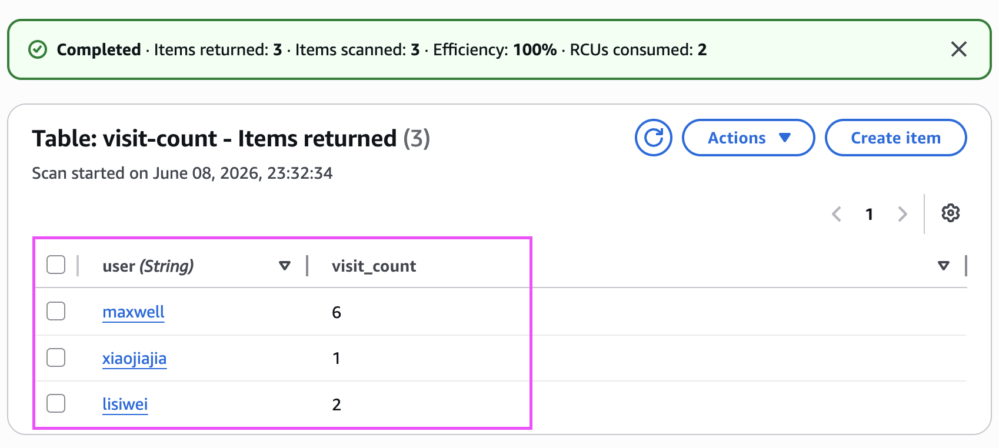

# terraform-lambda-dynamodb-apigateway
In this demo, I will use lambda for a serverless compute , dynamodb for persistent data store and api gateway for URL exposed to externals to count visitors all the services are deployed by terraform 

## Architecture
Here is the architecture overview


## Features

- API Gateway

  API Gateway is both the exit for the frontend and the entrance for the backend.   It serves as the bridge connecting the "frontend interface" and the "backend logic."
  API Gateway 既是前端的出口，也是后端的入口，它是连接“前端界面”与“后端逻辑”的桥梁
  It's the Only interface URL exposed to external users
  It is responsible for handling HTTP protocol details (such as CORS cross-origin configuration)
  When it receives a request, it forwards the request to the corresponding Lambda function based on the Integration rules you define

- Lambda
  
  It is the "Brain" of the system. It doesn't occupy servers; it only starts when a request arrives.

  It communicates with DynamoDB through the boto3 library to perform read and write operations on data.

  It gains execution permissions through IAM Role and logs its runtime status through CloudWatch.

- DynamoDb(the persistent storage)

  It is the "Memory" of the system. It requires no server management and provides direct key-value storage for Lambda to access and update the visit count.

- Terraform

  Intergrated in Githut actions workflow deploy.yaml to deploy all the infrastructure

## Usage

- the github actions will run after PR merged to main

   then you will get the api_endpoint_url also the API Gateway URL like this :

   ```shell
   api_endpoint_url = "https://iqyslc71gb.execute-api.us-east-1.amazonaws.com/prod/visit
   
   ```

- go to your terminal and type the following command :
  ```shell
  allen@192 terraform-lambda-dynamodb-python-count-visitors % curl -X POST https://iqyslc71gb.execute-api.us-east-1.amazonaws.com/prod/visit \
  -H "Content-Type: application/json" \
  -d '{"user": "maxwell"}'
  {"message": "Hello maxwell! You have visited us 6 times."}
  
  ```

- then go to DynamoDB to check the table and items like this:

  

  


  


